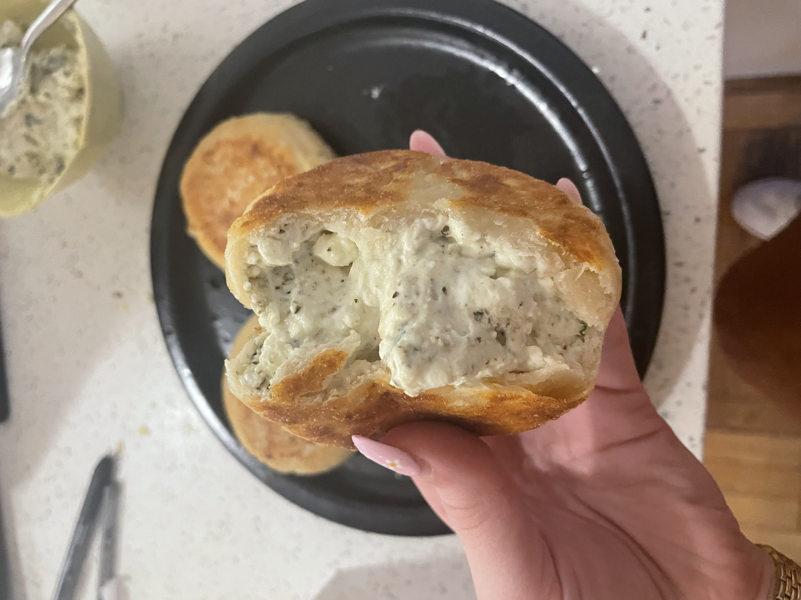

# Feta Pita Pockets

*This recipe makes 4 patties with maybe some leftover filling which is also delicious as a dip with chips*  
*This recipe includes both homemade pita as well as a delicious filling that can even be upgraded by adding spinach to the mix*

**Filling Ingredients**  
- 1/2 a container of crumbled feta 
- 1/2 a stick of cream cheese
- Mint (measured with your heart)
- A good heap herbs (I use a generic italian seasoning mix)

**Pita Ingredients**  
- 1 cup of flour
- 6 oz of plain greek yogurt
- Salt and pepper to taste
- A splash of water to get it to a good dough consistency

**Assembly**  
- Mix dough into one giant ball and cut into quarters
- Roll and flatten dough into a sheet
- Spread filling onto the dough, wrap like a dumpling, then flatten into a patty shape
- Cook in olive oil on low / medium heat until golden and crispy
- Enjoy! 

