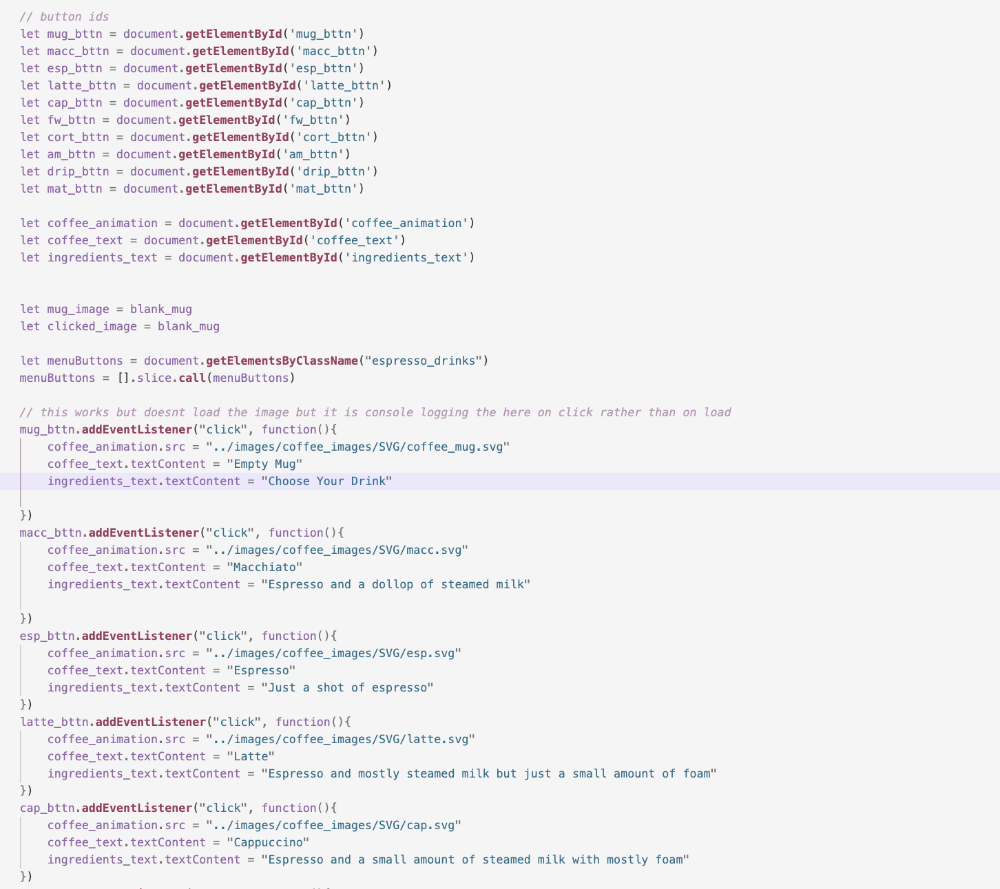

# Documentation for the Final

**Process Documentation**
- I worked a lot on the reformatting of pages by implementing bootstrap for the responsive nature of the pages. This was really helpful as I didnt have to use specific media queries for each of the pages and each of the different changes to the flex boxes and grids 
- I also worked a lot on adding the extra page entitled "coffee". This page is responsive using the bootstrap grid as well as the fact that it encorporates a slew of JavaScript in order to add the changing images with the selection of each button linked to each menu item
- Each page was a little bit difficult to reorganize however the only page that was specifically difficult was that of the contact page because of the iframe containing the google maps page of AVAbrew. It made it hard because it doesnt resize the same way that other items on the page does

**Issues and Challenges**
- I would have to say the most challenging aspect was that of adding the JavaScript in order to change the images of the different menu items after clicking the name of the item in the menu list
- I initially wanted to use the GSAP animation, however, I could not figure out how to do that with Greensock animation alone. Using GSAP it would be too difficult to do it so I decided to go purely with the useage of JavaScript instead of both. 

**What I Learned**
- I learned a lot in the process of "finishing" this for my final. I would say the part that stands out the most to me would be learning how to integrate some JavaScript into my html/css pages. I have used JavaScript before but the integration of it within a website is really new to me in general. I really enjoyed learning how to start that process and I look forward to continuing to learn how to use it in future projects

**If I Had More Time**
- If I had more time or more specifically more resources I would love to figure out how to integrate GSAP into my project. There were a few plugins on the most up to date version of GSAP that I saw that I would (if I had the money to get the full version) love to dive into. The only thing that I really regret about my final is that I didnt integrate GSAP elements into it. However, I feel like if I tried to add some in the next few days that it would turn out sloppy and unfinished and that is not what I would like to do. 
- I would also probably find a way to use JavaScript on more pages if I had more time. Maybe even using the google developers platform in order to add to the contact page a better map of AVAbrew's location. The iFrame works well enoough but it would be cool to try to add something a little more in depth using a different method that we talked about in class. 

**Code Segment**

- This is the segment of code of the JavaScript that was most difficult to figure out on how to make the image of the menu item's ingredients and the name of the item as well as the construction of the item change as a result of the menu item buttons being pressed 

**Link to the Final Project Repository**
[Lilyanne Jaczko's Final Project Repository](https://github.com/ljazzy51/jaczko_web_dev/tree/main/Homework/final)
